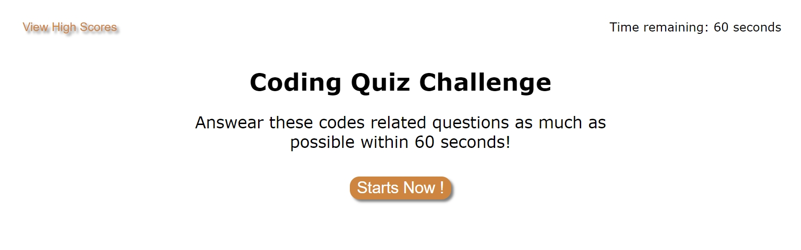
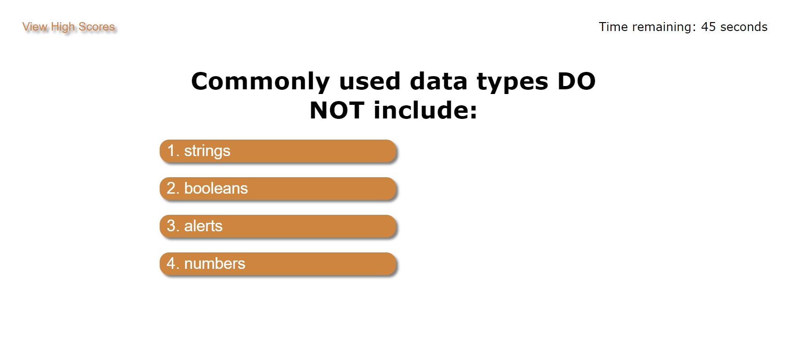
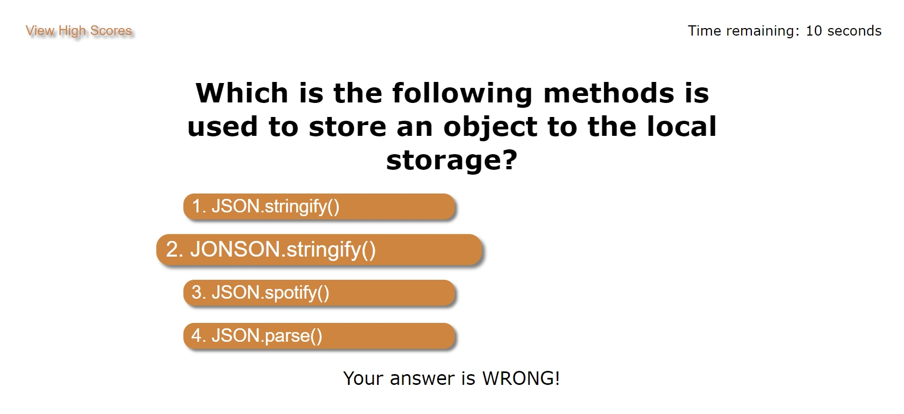
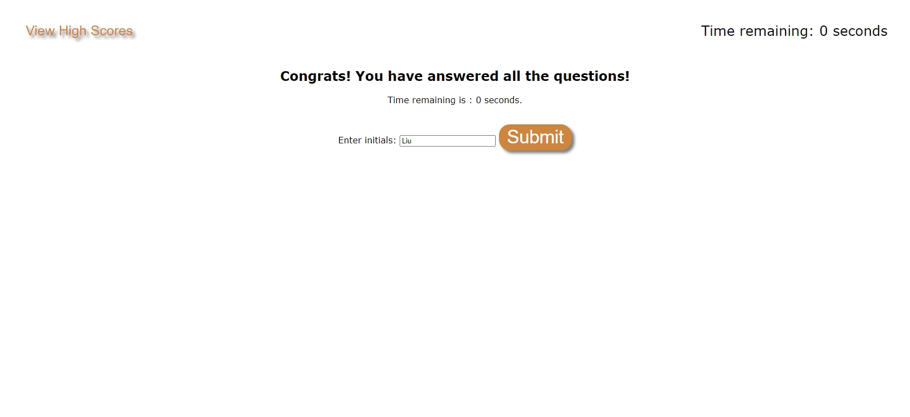
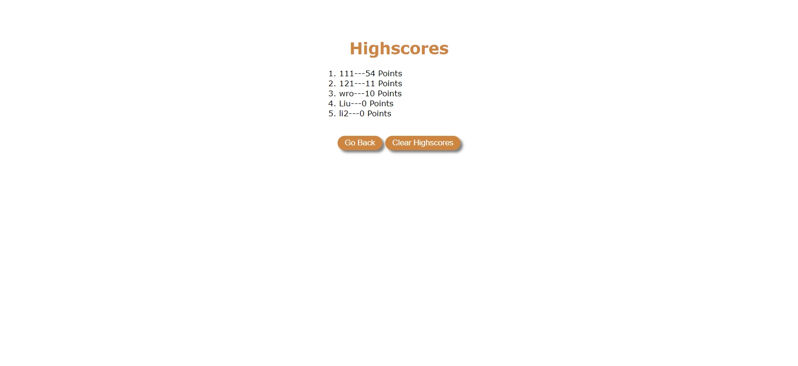

# codeQuizChallange

## Description

A page when click start button, several coding related quiz appeal with 4 answers to choose from.
- there is a 60 seconds time limits on the challenge.
- when a quiz is answered, there is a indication below showing the picked answer is right or wrong.
- picking either right or wrong answers will move on to the next questions.
- picing the wrong answer will trigger a time penalty with 15 seconds deducted.
- when answered all the questions or time runs out, the game is over.
- when game is over, a page asking the challengers to put down their initials.
- the initials with their time remaining (recorded as scores) are stored and shows on the high score board.
- scores are sorted by high score to low.
- the start page has a function to go to high score board directly.
- when click clear scores, all the score records will be removed.

## Illustration

open and view the contents on https://mkdkck.github.io/codeQuizChallenge/

the page should show like the following pic:
starting page:

quiz:

wrong answer indication:

end game:

score board:

HTML, CSS & JS codes can be examined on https://github.com/mkdkck/codeQuizChallenge

## Usage

- open the link to see a fully fucntional website.
- click the start button to start the challenge.
- keep answering the questions until game is finished.
- type in initials to keep your records on the board!
- clear the record board with the clear button.

## License

N/A

## Badges

